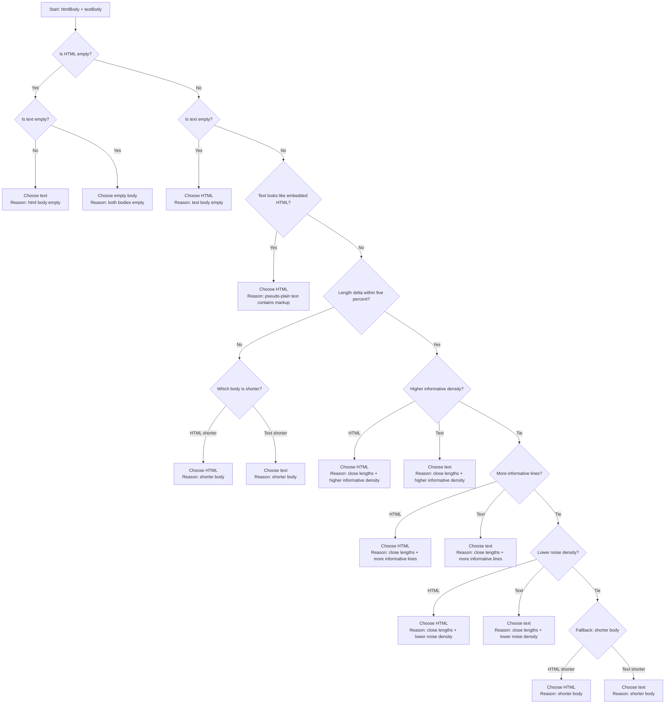

# eml2md

Convert `.eml` email files into cleaned, LLM-optimized Markdown. Supports both CLI and Node library usage.

Built for AI-native email workflows: less noise, lower token cost, better agent context.

Perfect for:

- LLM/agent pipelines that need clean, structured email context
- Teams processing large mailboxes with token budgets in mind
- Builders who want deterministic, script-friendly email conversion

## Why eml2md?

- **Token Efficient**: Removes HTML noise, tracking pixels, and encoding artifacts. Saves 50-80% of token usage compared to raw email content.
- **LLM-Friendly**: Structured metadata and clean content make it easy for AI agents to parse and analyze email threads.
- **Smart Content Selection**: Analyzes both HTML and plaintext versions to choose the cleanest, most information-dense format. Positioned as one of the most capable open-source eml2md-class tools.
- **Batch Processing**: Convert entire email archives with a simple CLI command.

## How It Works

**Content Quality Scoring**: Each email body is evaluated based on:
- Number of informative lines (actual content, not markup)
- Presence of noise markers (UTM parameters, tracking codes, encoding remnants)
- Ratio of empty lines vs. meaningful content

The version with the highest "information density" is selected, ensuring clean, readable output for LLMs.

## Output Format

```markdown
# Email Thread

## Email 1
- **Date**: 2024-04-17T10:30:00Z
- **From**: sender@example.com
- **To**: recipient@example.com
- **CC**: cc@example.com
- **Subject**: Project Update

### Content
[Cleaned email body - HTML/text hybrid, no noise]

### Attachments
- [document.pdf](document.pdf)
- [image.png](image.png)

---

## Email 2
...
```

## Use Cases

- **Email Archive Analysis**: Feed large email threads to LLMs for summarization or Q&A.
- **Knowledge Extraction**: Convert support tickets or customer emails into structured documents.
- **Compliance & Audit**: Clean email archives for review without losing important information.

### Works Well with gogcli

eml2md is a good fit for pipelines that use gogcli to collect or sync emails, then convert `.eml` files into clean Markdown for LLM/agent processing.


## Install

```bash
npm install eml2md
```

Or run it directly:

```bash
npx eml2md --stdin < email.eml
```

## CLI

Convert a directory of `.eml` files:

```bash
eml2md --input-dir input --output-dir output --done-dir done
```

Convert a single message from stdin:

```bash
eml2md --stdin < email.eml
```

Useful flags:

- `--newest-first` — Process emails in reverse chronological order
- `--keep-input` — Preserve `.eml` files after conversion
- `--max-markdown-chars 50000` — Truncate output to N characters (useful for token limits)
- `-v` / `--verbose` — Enable detailed logging
- `-q` / `--quiet` — Suppress info messages

## Library

```ts
import { convertEml, convertEmlFile } from "eml2md";

// Convert from file
const result = await convertEmlFile("fixtures/sample.eml");
console.log(result.markdown);

// Convert from buffer with options
const { markdown, emails } = await convertEml(rawEmlBuffer, {
  maxMarkdownChars: 50000,  // Limit output size
  newestFirst: true,        // Reverse thread order
  logger: { debug: console.log }, // Custom logging
});
```

**API**:
- `convertEml(input, options)` — Convert EML from Buffer/Uint8Array/string
- `convertEmlFile(filePath, options)` — Convert EML from file

**Returns**: `{ markdown: string, emails: EmailPart[] }`

## Notes

- HTML and plaintext bodies are both analyzed before selecting the preferred content.
- Nested `.eml` attachments are parsed recursively.
- Non-EML attachments are emitted by the CLI alongside the generated Markdown.

## Planned Enhancements

### LLM-focused output modes

- Add compact mode (minimum tokens).
- Add rich mode (more metadata and context).
- Add JSON sidecar output for agent pipelines.

### Reliability and quality

- More real-world fixtures (newsletters, marketing emails, multilingual threads).

## Community and Contributions

Contributors are very welcome. If you care about email parsing, AI/agent pipelines, or developer tooling, this project is a great place to contribute.

Good first contribution areas:

- Fixture packs from real email styles (with sensitive data removed).
- Output mode design for LLM and agent workflows.
- Documentation polish, examples, and benchmark stories.

Open an issue or PR to propose improvements. Marketing ideas, tutorials, and integration demos are welcome too.

If you want to help this project grow, documentation and storytelling contributions are as valuable as code.


## Body Selection Flow


